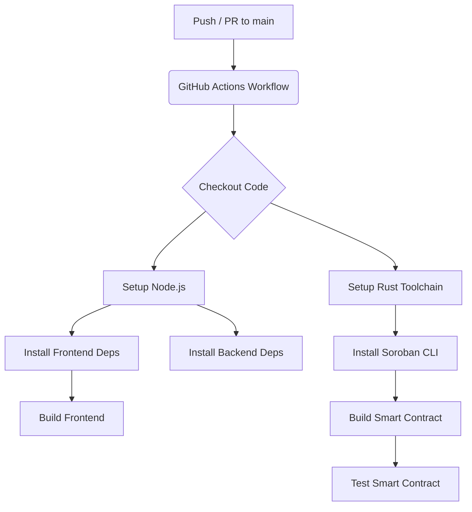

# PayStream

## Description
Paystream is a non-custodial payment platform that enables users to send, receive, and accept cryptocurrency payments with near-zero fees and instant settlement. Built on the Stellar network, it leverages Soroban smart contracts for trustless payment settlement while maintaining a familiar web experience.
## Key Features

### Customer Features
- Send payments to merchants via QR code scanning
- Pay with the Freighter browser extension (non-custodial)
- View transaction history and receipts
- Track payment status with blockchain verification

### Merchant Features
- Merchant registration with auto-generated merchant codes (CP100001 format)
- Business profile management (name, description, category, contact details)
- QR code generation for payment discovery (PNG/SVG download)
- Sales analytics dashboard (total customers, repeat rate, top customers)
- Transaction history with search, filter, pagination, and sorting
- Wallet linking and verification against the Stellar network

### Blockchain Features
- Soroban smart contract for trustless payment settlement
- Atomic payments with built-in fee deduction (basis points)
- Deterministic payment IDs via SHA-256 for idempotency
- Nonce-based replay protection
- Token whitelist for supported assets
- Contract pause/unpause (emergency stop)
- Contract upgrade mechanism
- On-chain event emission (`PaymentCompleted`, `ConfigUpdated`, `ContractUpgraded`)
- Background event sync service for off-chain confirmation
- Payment existence and status queries directly from the contract
- Merchant/customer payment counters stored on-chain

### Security Features
- JWT-based authentication with 7-day token expiry
- Password hashing with bcrypt (12 salt rounds)
- Express-validator for input validation and sanitization
- Helmet for secure HTTP headers
- CORS with configurable origins
- Role-based access control (user, merchant, admin)
- Stellar public key validation on wallet linking
- Wallet verification against the live Stellar network
- Soroban authorization framework (cascading auth for token transfers)
- Contract-level input validation (amount, memo length, reference length, self-payment prevention)

### Backend Features
- RESTful API with Express.js (ES modules)
- MongoDB with Mongoose ODM (8 models)
- Centralized configuration with environment validation
- Comprehensive error handling with consistent response format
- Blockchain service layer (Stellar Horizon + Soroban RPC)
- Event-driven architecture for on-chain event processing

### Frontend Features
- React 19 with Vite 8 build tooling
- Dark/light theme with CSS variables and system preference detection
- Responsive design (desktop, tablet, mobile)
- Real authentication flow (login, register, session restore)
- Protected and guest route handling
- Loading skeletons, error states, and empty states for every page
- **Direct Soroban Contract Integration**: Uses `@stellar/stellar-sdk` to query on-chain data directly via Soroban RPC, verifying payments and contract state on-chain.
- QR code rendering with download (PNG) and copy (SVG) support
- Transaction search, filter, sort, and pagination
- Toast notifications and modal system
- Wallet connection status display
- Customer analytics cards on merchant dashboard

---
## Project Links

- **Live Demo:** [vercel](https://vercel.com/sudo7523-pixels-projects/paystream)
- **Demo Video:** [demo](https://drive.google.com/file/d/1UEX3KizU2aaTUW_DDfjGAshs_I7Mmw5P/view?usp=sharing)
- **Contract Deployment Address:** [`CDYXZNWEP7LEMWNCI4GJHEKS2I62HZGOINULO32CNZZFORPTLT7KI4HR`](https://lab.stellar.org/r/testnet/contract/CDYXZNWEP7LEMWNCI4GJHEKS2I62HZGOINULO32CNZZFORPTLT7KI4HR)
- **Transaction Hash:** [`f09fcb1754423356778e34ba5dfdeb2c91f187c5580287932eca97f7d100d240`](https://stellar.expert/explorer/testnet/tx/f09fcb1754423356778e34ba5dfdeb2c91f187c5580287932eca97f7d100d240)

## Documentation

### Installation

1. **Clone the repository:**
   ```bash
   git clone https://github.com/[YOUR-USERNAME]/paystream.git
   cd paystream
   ```

2. **Install dependencies:**
   ```bash
   cd frontend
   npm install
   ```

3. **Build the contract:**
   Make sure you have the `stellar` CLI and Rust toolchain installed.
   ```bash
   cd ../contract
   stellar contract build
   ```

### Running Locally

To run the frontend:
```bash
cd frontend
npm run dev
```

### Testing

Run the smart contract tests:
```bash
cd contract
cargo test
```

## Folder Structure

```text
Coin-Pay-main/
├── .github/
│   └── workflows/
│       └── ci.yml
├── backend/
│   ├── src/
│   ├── package.json
│   └── .env
├── contract/
│   ├── src/
│   ├── test_snapshots/
│   └── Cargo.toml
├── frontend/
│   ├── public/
│   ├── src/
│   ├── index.html
│   ├── package.json
│   └── vite.config.js
├── README.md
└── soroban.js
```

## CI/CD Pipeline Configuration

This project uses GitHub Actions for Continuous Integration. The pipeline automatically installs dependencies, builds the frontend and smart contract, and runs contract tests on every push and pull request to the `main` branch.

### Pipeline Diagram



**`.github/workflows/ci.yml`**:

```yaml
name: CI/CD Pipeline

on:
  push:
    branches:
      - main
  pull_request:
    branches:
      - main

jobs:
  build-and-test:
    runs-on: ubuntu-latest

    steps:
      - name: Checkout Code
        uses: actions/checkout@v3

      - name: Setup Node.js
        uses: actions/setup-node@v3
        with:
          node-version: '18'

      - name: Install Frontend Dependencies
        working-directory: ./frontend
        run: npm install

      - name: Build Frontend
        working-directory: ./frontend
        run: npm run build

      - name: Install Backend Dependencies
        working-directory: ./backend
        run: npm install

      - name: Setup Rust Toolchain
        uses: actions-rust-lang/setup-rust-toolchain@v1
        with:
          toolchain: stable
          target: wasm32-unknown-unknown

      - name: Install Soroban CLI
        run: cargo install --locked soroban-cli

      - name: Build Smart Contract
        working-directory: ./contract
        run: cargo build --target wasm32-unknown-unknown --release

      - name: Test Smart Contract
        working-directory: ./contract
        run: cargo test
```

## Screenshots
## Deployed Contract


### Costumer dashboard:

### Merchant  dashboard:

### UI


### Mobile Responsive UI


### CI/CD Pipeline Running


### Test Output (3+ Passing Tests)


## License

This project is licensed under the MIT License.
